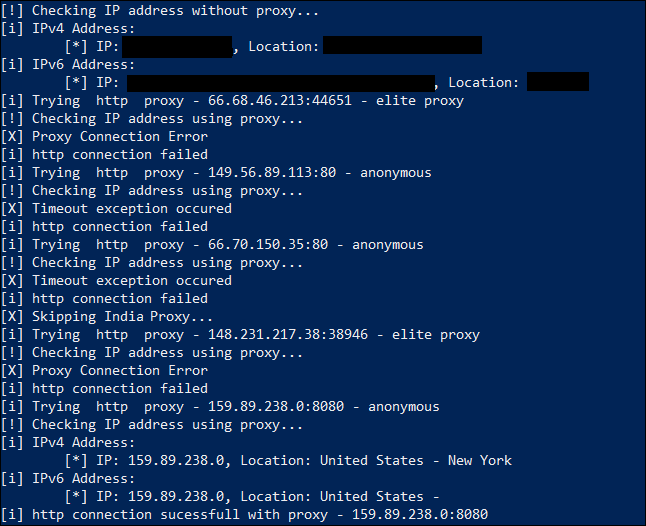

# python-requests-proxy
Script to fetch a new proxy from the web to send web requests using python's requests library

The script checks [free-proxy-list](https://free-proxy-list.net/) to get a list of free proxy and uses [ipleak](https://ipleak.net) to check their IP and location.
The scripts will skip transparent proxies.

## Usage:

Copy proxy.py on the same folder of your script.

Function to get new proxy: __get_proxy(protocol)__ 
- Protocol should be the protocol used by the requesting url (http/https)

## Example: 
```
import proxy 
response=s.get(url, proxies=get_proxy("http"), allow_redirects=True, timeout=30)
```

You can also mention if you want to skip proxy of a specific country on line no. 9 in proxy.py
```
country="India"
```

## Output:

